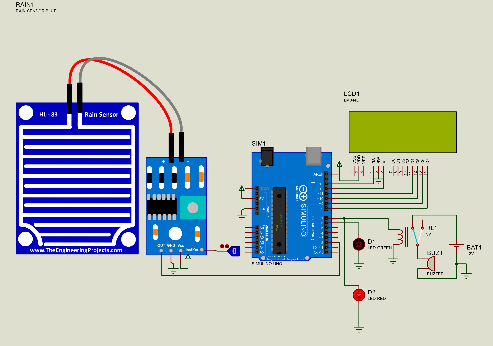

# Arduino Rain Detection and Alert System

A rain detection and alert system built and tested in Proteus. The project uses an Arduino Uno and a rain sensor to detect rain and display the current status using an LCD, LED, and buzzer.

## Circuit

## How It Works

The Arduino reads the rain sensor through digital pin D2.

- When rain is detected, the buzzer turns on and the LCD displays `RAINING...`.
- When no rain is detected, the buzzer remains off and the LCD displays `NO RAIN`.
- An LED provides an additional visual indication of the sensor state.

## Components

- Arduino Uno
- Rain sensor
- LCD display
- LED
- Buzzer

## Project Files

- `arduino-code/` — Arduino source code
- `proteus-simulation/` — Proteus circuit file

## Proteus Rain Sensor Library

The simulation uses the **Rain Sensor Library for Proteus** from **The Engineering Projects**. The third-party library files are not included in this repository.

[Download the required rain sensor library](https://www.theengineeringprojects.com/2018/07/rain-sensor-library-for-proteus.html)

## Running the Simulation

1. Install the required rain sensor library in Proteus.
2. Open the `.DSN` file from the `proteus-simulation` folder.
3. Load the compiled Arduino program into the Arduino Uno if required.
4. Run the simulation and change the sensor state to test the system.
